# Trust-Region Policy Optimization for Velocity-Conditioned Ant Locomotion

[](https://www.python.org/)
[](https://gymnasium.farama.org/)
[](https://pytorch.org/)
[](LICENSE)

## Table of Contents
- [Abstract](#abstract)
- [Introduction](#introduction)
- [Method](#method)
- [Experiments](#experiments)
- [Results](#results)
- [Discussion](#discussion)
- [Future Work](#future-work)
- [Installation](#installation)
- [Usage](#usage)
- [References](#references)

## Abstract

This repository implements Trust Region Policy Optimization (TRPO) for training a quadrupedal robot (Ant) to perform velocity-conditioned locomotion tasks. The agent learns to track commanded velocities while maintaining stable and efficient gaits. Through iterative experimentation, we demonstrate the challenges and successes in scaling from single-environment training to parallelized setups with multi-dimensional velocity commands.

## Introduction

Quadrupedal locomotion in robotics presents unique challenges in balancing stability, energy efficiency, and responsiveness to velocity commands. Trust Region Policy Optimization (TRPO) provides a principled approach to policy gradient methods by constraining policy updates to maintain monotonic improvement.

This work extends the standard Ant-v5 environment with velocity conditioning, where the agent receives commanded linear and angular velocities and is rewarded for accurate tracking while penalizing unstable postures and inefficient motion.

### Key Contributions
- Custom velocity-conditioned Ant environment with multi-objective reward function
- TRPO implementation with parallel environment support
- Experimental analysis of training dynamics across different command dimensions and parallelization strategies
- Demonstration of emergent walking behaviors in simulation

## Method

### Environment Design

The `VelocityAntEnv` wrapper extends Gymnasium's Ant-v5:
- **Observation Space**: Appends commanded velocity vector `[Vx, Vy, yaw_rate]` to the base Ant observations
- **Command Resampling**: Velocity commands are resampled every 100 steps to encourage generalization
- **Reward Function**: Multi-component reward combining:
  - Command tracking accuracy (weighted by 1.0)
  - Posture stability (weighted by 0.5)
  - Energy efficiency (weighted by -0.01)
  - Joint smoothness (weighted by -0.001)
  - Gait symmetry (weighted by 0.1)
  - Alive bonus (weighted by 0.1)

### Policy and Value Networks

- **Policy Network**: Diagonal Gaussian actor with state-independent log standard deviation
- **Value Network**: Separate neural network baseline for variance reduction
- Both networks use 2-layer MLPs with 256 hidden units and ReLU activations

### TRPO Algorithm

Implementation follows Schulman et al. (2015):
- Conjugate gradient solver for trust region optimization
- Fisher-vector product computation via KL Hessian-vector product
- Backtracking line search for step size selection
- Generalized Advantage Estimation (GAE) with λ=0.95

## Experiments

We conducted three progressive experiments to develop and validate the velocity-conditioned locomotion policy:

### Checkpoint 1: Single Environment with Multi-Command Training
- **Setup**: Single environment instance, 3-dimensional velocity commands (Vx, Vy, yaw_rate)
- **Training Duration**: 4 hours of simulation time
- **Outcome**: Agent failed to learn meaningful locomotion behaviors
- **Analysis**: Insufficient exploration and sample inefficiency in single-environment setup

### Checkpoint 2: Parallel Environments with Unidirectional Training
- **Setup**: 8 parallel environments with domain randomization (mass, friction, action delays), reduced to 1-dimensional velocity command (Vx only)
- **Training Duration**: 40 minutes of simulation time
- **Outcome**: Emergent walking behavior achieved
- **Analysis**: Parallelization and domain randomization dramatically improved sample efficiency and robustness

### Checkpoint 3: Parallel Environments with Multi-Command Training
- **Setup**: 8 parallel environments with domain randomization (mass, friction, action delays), 3-dimensional velocity commands (Vx, Vy, yaw_rate)
- **Hyperparameters**: Tuned trust region size and learning rate for stability
- **Test Command**: Vx=0.8 m/s, Vy=0.8 m/s, yaw_rate=0.4 rad/s
- **Outcome**: Robust command tracking with stable locomotion

## Results

### Checkpoint 1: Initial Multi-Command Attempt
The agent struggled to learn basic locomotion, exhibiting random joint movements without directional control.


**Training Diagnostics:**
- Mean episode return remained low (~500) with high variance
- Velocity tracking error: 0.75-0.85 throughout training
- KL divergence stable near trust region boundary

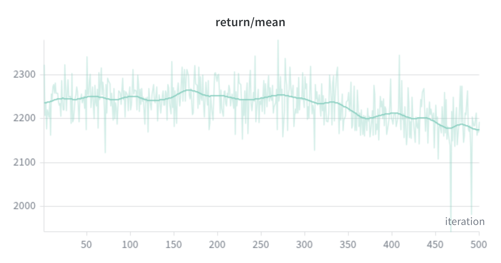
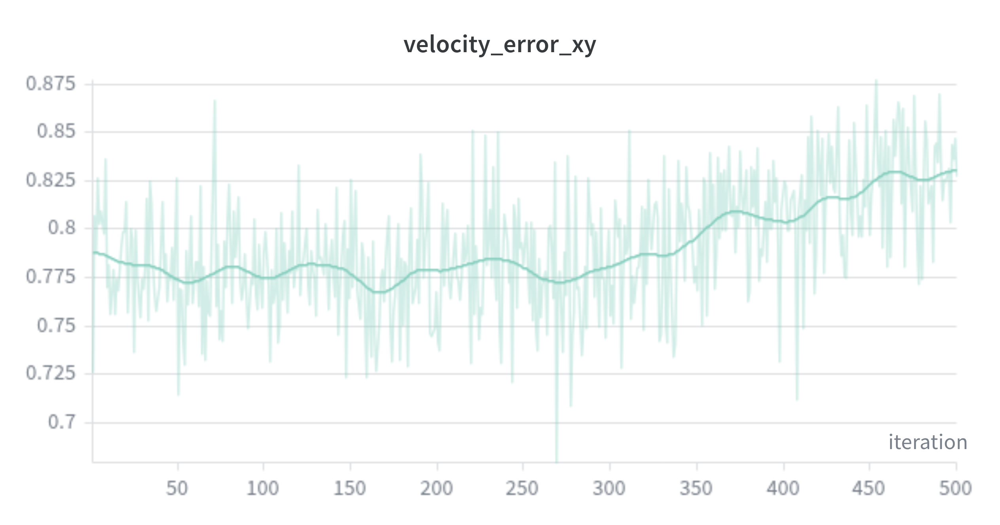
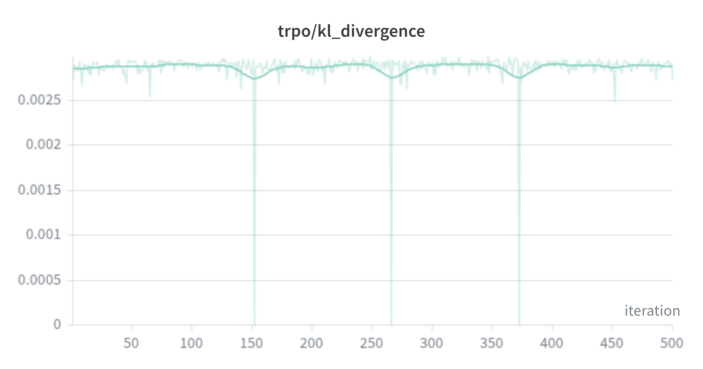

### Checkpoint 2: Successful Unidirectional Walking
With parallel environments and simplified command space, the agent rapidly learned coordinated walking.

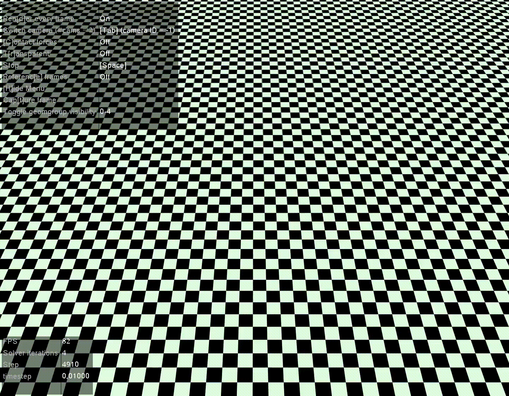

**Training Diagnostics:**
- Rapid convergence to mean return ~2200
- Velocity tracking error decreased to ~0.2
- Stable KL divergence indicating active trust region constraint

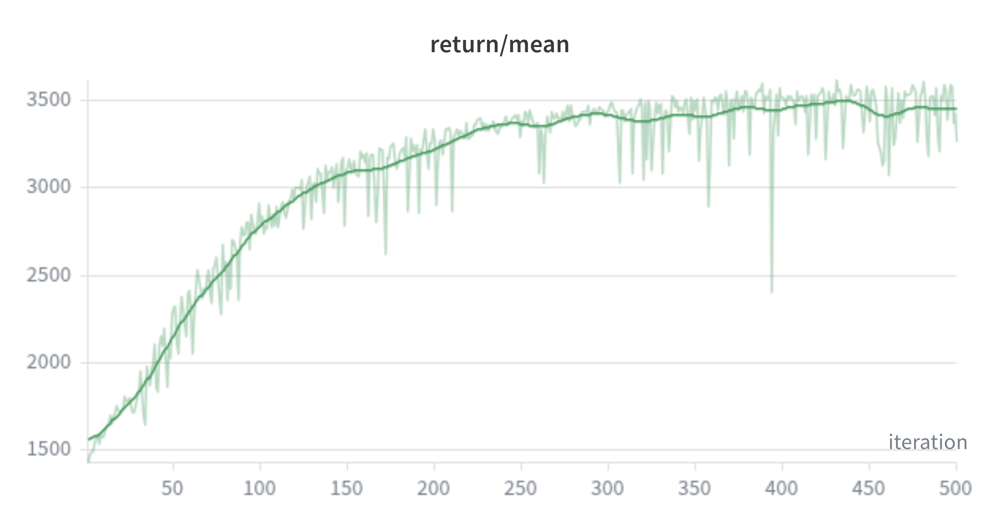
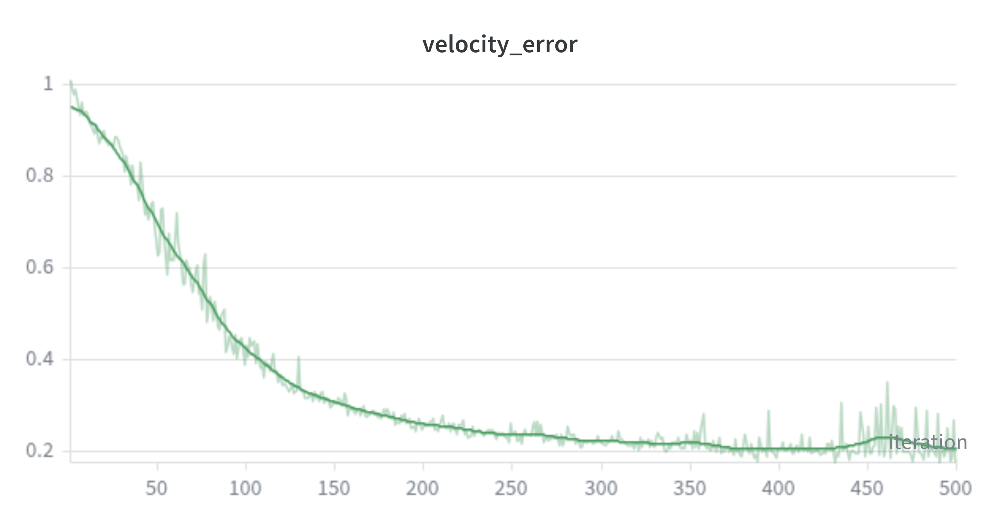
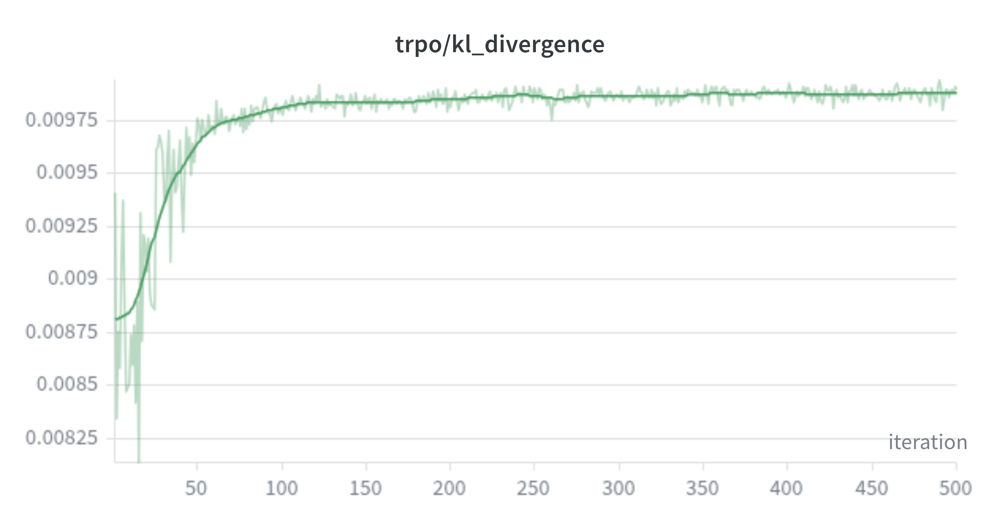

### Checkpoint 3: Multi-Command Tracking
The final model demonstrates competent tracking of complex velocity commands.

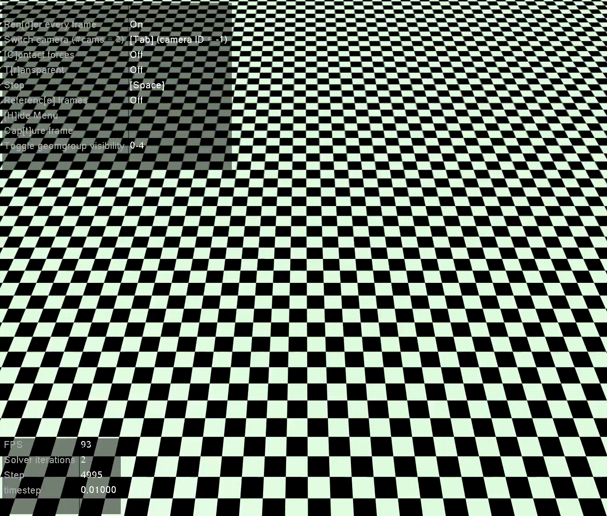

**Training Diagnostics:**
- Converged mean return ~2400
- Multi-dimensional velocity tracking with combined error ~0.3
- Maintained policy update stability

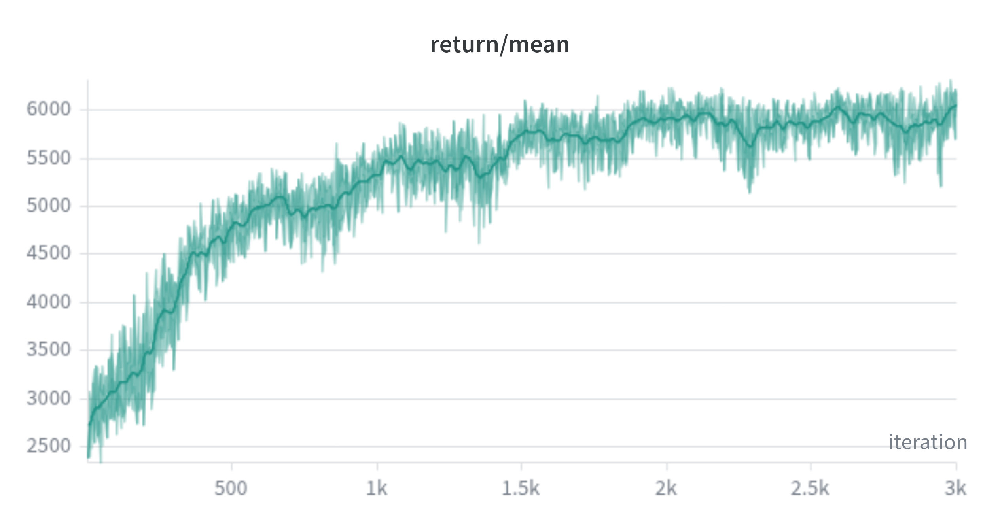
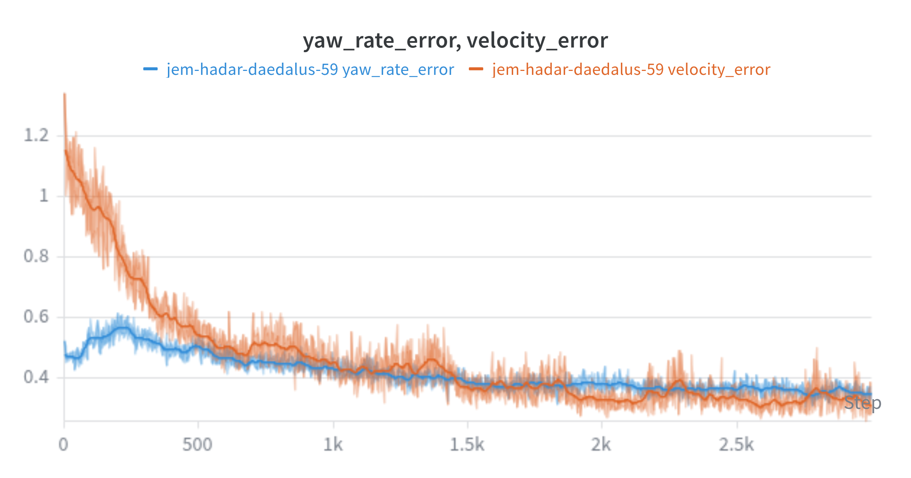
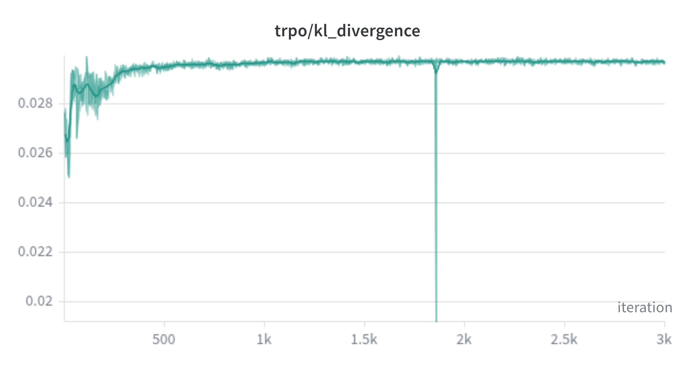

## Discussion

The experimental progression highlights critical insights for reinforcement learning in locomotion tasks:

1. **Sample Efficiency**: Single-environment training proved insufficient for complex multi-dimensional control, requiring parallelization for practical convergence times.

2. **Domain Randomization**: Incorporation of randomization across mass, friction, and action delays in checkpoints 2 and 3 enhanced policy robustness and generalization capabilities.

3. **Curriculum Learning**: Starting with unidirectional commands allowed the agent to develop fundamental walking skills before tackling full 3D velocity tracking.

4. **Reward Design**: The multi-objective reward successfully balanced competing goals of accuracy, stability, and efficiency.

5. **Hyperparameter Sensitivity**: Trust region size and learning rate required careful tuning for multi-command scenarios.

## Future Work

### Immediate Improvements
- **Extended Training**: Current models show promising tracking but require additional training iterations for fully stable and energy-efficient locomotion
- **Hardware Constraints**: Limited computational resources restricted training duration and parallel environment count

### Research Directions
- **Real-world Transfer**: Validation on physical quadrupedal platforms
- **Terrain Adaptation**: Extension to uneven or dynamic environments
- **Multi-agent Coordination**: Swarm locomotion with inter-agent communication
- **Energy Optimization**: Advanced power consumption modeling and minimization

### Technical Enhancements
- **Advanced Baselines**: Comparison with PPO, SAC, and other modern RL algorithms
- **Neural Architecture**: Investigation of recurrent policies for temporal gait planning
- **Sim-to-Real**: Domain randomization and system identification techniques

## Installation

```bash
# Clone the repository
git clone https://github.com/yourusername/trpo-ant-locomotion.git
cd trpo-ant-locomotion

```

### Requirements
- Python 3.8+
- PyTorch 2.0+
- Gymnasium 0.29+
- Mujoco 2.3+
- Weights & Biases (for logging)

## Usage

### Training
```bash
python train.py
```

### Evaluation
```bash
python test.py
```

### Custom Commands
```python
from test import evaluate_policy
from models import PolicyNetwork

policy = PolicyNetwork()
policy.load_state_dict(torch.load('checkpoints/best_model.pt'))

# Evaluate with specific velocity command
evaluate_policy(policy, command=[0.8, 0.8, 0.4])
```

## Repository Structure
- `environment_wrapper.py`: Velocity-conditioned Ant environment
- `models.py`: Policy and value network implementations
- `trpo.py`: TRPO algorithm core
- `train.py`: Training pipeline with parallel environments
- `test.py`: Evaluation and visualization scripts
- `checkpoints/`: Saved model weights
- `results/`: Training diagnostics and behavior recordings
- `xml/ant_v4_updated.xml`: Modified Ant robot model

## References

1. Schulman, J., Levine, S., Abbeel, P., Jordan, M., & Moritz, P. (2015). Trust region policy optimization. In *International Conference on Machine Learning* (pp. 1889-1897).

2. Brockman, G., Cheung, V., Pettersson, L., Schneider, J., Schulman, J., Tang, J., & Zaremba, W. (2016). OpenAI Gym. *arXiv preprint arXiv:1606.01540*.

3. Todorov, E., Erez, T., & Tassa, Y. (2012). MuJoCo: A physics engine for model-based control. In *IEEE/RSJ International Conference on Intelligent Robots and Systems* (pp. 5026-5033).

## Citation

If you use this code in your research, please cite:

```bibtex
@misc{trpo-ant-locomotion,
  title={Trust-Region Policy Optimization for Velocity-Conditioned Ant Locomotion},
  author={Pratik Shiveshwar},
  year={2026},
  publisher={PratikShiv},
  url={https://github.com/PratikShiv/Trust-Region-Policy-Optimization}
}
```

---

*This repository is part of ongoing research in reinforcement learning for quadrupedal robotics. Contributions and collaborations are welcome!*

## Limitations

The current repository is a strong foundation, but the implementation has some important gaps that should be addressed before this work can be considered fully reliable
